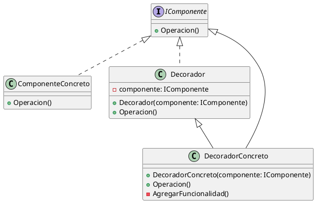

# Welcome to Dotnet Guild

  <a href="https://github.com/slidevjs/slidev" target="_blank" alt="GitHub" title="Open in GitHub"
    class="text-xl slidev-icon-btn opacity-50 !border-none !hover:text-white">
    <carbon-logo-github />
  </a>

 b 

<!--
The last comment block of each slide will be treated as slide notes. It will be visible and editable in Presenter Mode along with the slide. [Read more in the docs](https://sli.dev/guide/syntax.html#notes)
-->

---
transition: fade-out
---
# Patrón Decorador en .NET con C#

- **Objetivo:** Añadir funcionalidades de manera dinámica a objetos.
- **Estructura:**
  - Componente
  - ObjetoConcreto
  - Decorador
  - DecoradorConcreto

---
transition: fade-out
---
# Slide 1: Introduction to Decorator Pattern

- **Objective:** Enhance objects dynamically without altering their structure.

- **Key Components:** Is and Have

## How It Works

- **Component Interface:** Base functionality definition.
- **Concrete Component:** Basic object without extra functionalities.
- **Decorator:** Wraps Component, adds behaviors.
- **Concrete Decorator:** Extends Decorator, stacks functionalities.

---
transition: fade-out
---

## Benefits

- **Flexibility:** Dynamic behavior modification.
- **Open/Closed Principle:** Objects open for extension, closed for modification.
- **Composition over Inheritance:** Promotes composition to avoid subclass explosion.

